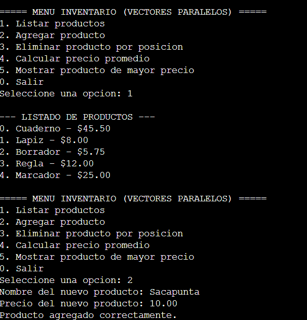

# Inventario-de-una-tienda-con-vectores-paralelos-

Implementar un programa de inventario de tienda con vectores paralelos en C++

Este programa, escrito en C++, utiliza un menú interactivo y dos vectores paralelos (vector<string> productos y vector<float> precios) para gestionar el inventario de una tienda. La posición i de un vector corresponde siempre al mismo producto que la posición i del otro vector.

El usuario puede listar todos los productos junto a su precio, agregar un nuevo producto, eliminar un producto por posición, calcular el precio promedio del inventario y determinar cuál es el producto de mayor precio.

Estructura del programa
Vectores paralelos: productos almacena los nombres y precios almacena los valores correspondientes, manteniendo la misma posición entre ambos.
Agregar (push_back()): al agregar un producto, se inserta su nombre y su precio al final de ambos vectores en el mismo momento.
Recorrido (for): se recorre cada posición de los vectores para imprimir "producto - precio", calcular el promedio y buscar el precio más alto.
Eliminar (erase()): se elimina un producto por posición en ambos vectores a la vez, manteniendo la correspondencia entre ellos.
Validación: se usa at() para verificar que la posición exista antes de eliminar; si la posición es inválida, se captura la excepción y se muestra un mensaje de error sin cerrar el programa.
Cómo compilar y ejecutar
bash
g++ -o inventario inventario_vectores_paralelos.cpp
./inventario

